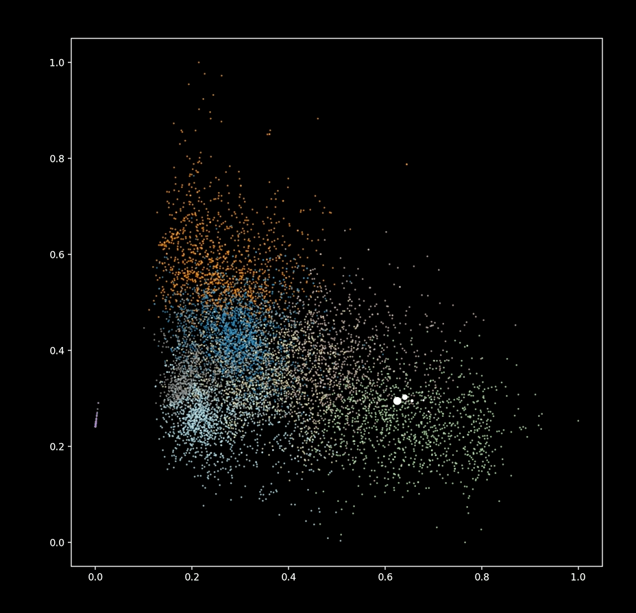

# tidal-sound-explorer
tidal-sound-explorer is a tool for analyzing a libarary of audio samples and end explore them on a 2D plane using TidalCycles live coding languge.
The idea is heavily inspired by the Flucoma project. Currently non of the Flucoma tools is used here, I prefred to implemet it all in python by myself (it's easier and more fun for me :) )

The workflow is as flows:
1. Change the local paths in config.py
2. Run the script `analyze_samples.py`. This script will:
    1. Read all of the samples from your local tidal cycles sounds directory.
    2. Segment long samples into small chunck using onset detector.
    3. Extract audio features for each segment. 
    4. The segments information (including path, strat and end time, and audio features) will be stored in a csv file. (The segments audio is not copied into new files)
3. Add to your `BootTidal.hs` file the code from `add_to_BootTidal.hs`
4. Run the scripts `player.py`. This script will take care of listening to tidal, selecting the samples based on the tidal message and sending it to Supercollider over OSC.
5. Run the scripts `plotter.py`. This script will plot the 2D embedding of the samples and will interactively in real time will plot the played samples. (It is not necessary to run this script to make sounds)
6. Run tidalcycles (and Supercollider and Superdirt of course). Try executing the following code:
```
d1
$ struct "t*16"
$ x (range "0.6" "0.7" $ fast "1" sine)
# y (range "0.2" "0.3" $ fast "1" cosine)
# c "w" -- color
# room 0.5
```
If everything went well you should see the some points moving and hear some (hopefully cool!) sounds:


(notice that you can pass any superdirt effect with the message, like `# room 0.5` in the example)

If "x" or "y" are specified (as in the example above) the nearest point in the 2D plane will be played. 
If they are not specified a random segment will be selected.

It is possible to filter the segments by any column in the data frame. Here is an example
```
d1
$ struct "t(5,8)"
$ pF "keep_only_below_spectral_centroid" 500
# pF "keep_only_above_spectral_centroid" 200
```

This example will play only segments with `spectral_centroid` between 200 and 500 (i.e relatively low pitch sounds). 
Since "x" and "y" are not specified, a random segment will be selected.
The format of the filtering message is `"keep_only_{above/below/equal}_{column name}"`.

And here is another example that demostrates filtering by sample name (it should work if you have [extra-samples](https://github.com/yaxu/spicule/tree/master/extra-samples)):
```
d1
$ stack [
id
$ struct "t(3,8)"
$ pF "keep_only_below_spectral_centroid" 300
# pF "keep_only_above_spectral_centroid" 200
# pS "keep_only_equal_s" "kick"
# release 0.2
# gain 1.5
, id
$ fast "{1!4 2}%7"
$ fast "{1!4 2}%8"
$ struct "t(8,8)"
$ pS "keep_only_equal_s" "foley"
# pF "keep_only_below_spectral_centroid" 6000
# pF "keep_only_above_spectral_centroid" 5000
# release 0.1
# gain 1.2
# room 0.4 
# c "r"
, id
$ pS "keep_only_equal_s" "snare(2,4,1)"
# gain 2
# c "g"
]
```


There are many more things to explore using this tool (better segmentation, better features, more 2d embeddings, and more...). Feel free to contact me if you are interested :)
